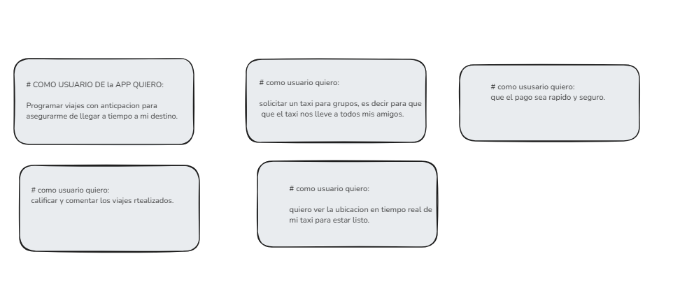
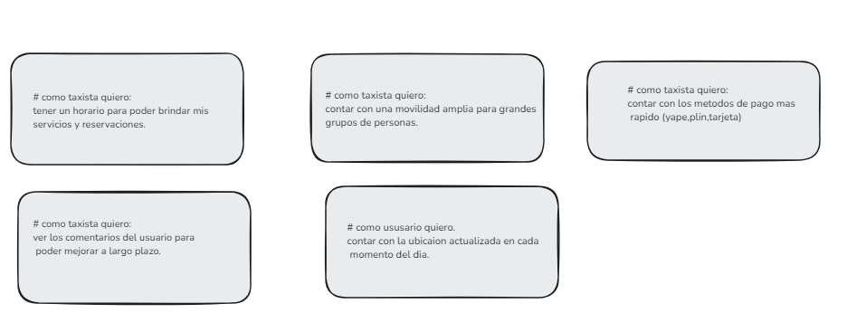

## TAXI CHURRO

## PROBLEMAS
cuando una personha quiere una m0ovilidad estas estan demasiado lejos de donde se encuentra ella, por ese motivo seria suelen llegar tarde a su lugar de destino.

## SOLUCIONES
la solucion seria crear una app publica donde podras solicitar un taxi o una mototaxi, hasta la puerta de tu casa en tan solon unos minutos sin necesidad de salir a calle ni de buscar una movilidad.

## ACTORES
mis actores son los siguientes:
# usuario:
tendra la opcion de solicitar un taxi hasta la puerta de su hogar, tendre que seleccionar las siguientes opciones:
-iniciar secion o registrarse
-seleccionar taxi disponible
-dirrecion de su casa
-destino
-metodo de pago 
# taxista:
tendra la opcion de incribirse ala app y dar sus servicios, tendra que seleccionar las siguientes opciones:
-iniciar secion o registrarse
-rellenar perfil
-activar si el taxi esta disponible
-metodo de pago
# ADMINISTRADOR:
TENDRALA OPCION DE CONTROLAR Y SELECCIONAR LASACTIVIDADES DE LOS USARIOS Y LOS TAXISTAS.

## HISTORIAS DE USUARIO:

# COMO USUARIO DE la APP QUIERO:
Programar viajes con anticpacion para asegurarme de llegar a tiempo a mi destino.
# como usuario quiero:
solicitar un taxi para grupos, es decir para que que el taxi nos lleve a todos mis amigos.
# como ususario quiero:
que el pago sea rapido y seguro.
# como usuario quiero:
calificar y comentar los viajes rtealizados.
# como usuario quiero:
quiero ver la ubicacion en tiempo real de mi taxi para estar listo.

# COMO TAXISTA:

# como taxista quiero:
tener un horario para poder brindar mis servicios y reservaciones.
# como taxista quiero:
contar con una movilidad amplia para grandes grupos de personas.
# como taxista quiero:
contar con los metodos de pago mas rapido (yape,plin,tarjeta)
# como taxista quiero:
ver los comentarios del usuario para poder mejorar a largo plazo.
# como ususario quiero.
contar con la ubicaion actualizada en cada momento del dia.

## DIAGRAMA DE CASOS DE USO:
ge.png)e.png)

## mapa de navegacion
 .png)e.png)

## PATRON DE ARQUITECTURA:
